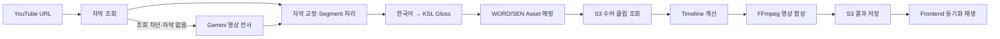

# 공농 (Gongnong)

> AI 기반 YouTube 한국수어 영상 변환 서비스

YouTube URL을 입력하면 영상의 자막·음성을 분석해 한국수어(KSL) Gloss로 변환하고, 수어 Avatar 클립을 원본 타이밍에 맞춰 합성하는 콘텐츠 접근성 프로젝트입니다.

## 담당 작업

### AI · 3D Avatar

- 기존 3D 수어 데이터를 가공해 손 모양 보정용 학습 데이터셋 구축
- 합성 노이즈와 실제 추출–정답 Pair 기반 손 모션 학습 데이터 제작
- BiGRU 손 모션 디노이저 학습 및 KNN 방식과 성능 비교
- 1,500개 수어 단어·약 21.6만 손 프레임 기반 KNN 손 모양 보정 구현
- 기존 약 3,000개 수어 Asset에 없던 자음 18종(`WORD3002`~`WORD3019`)의 신규 Avatar Asset 제작
- 자음 18종·1,454프레임의 Baseline/KNN/손가락 방향 보정 결과 비교 및 Blender 렌더링 검증
- F10·F20 VRM Avatar 리타게팅과 손가락 방향·회전 보정
- 키포인트 보정부터 Avatar 생성·렌더링까지 One-shot 실행 자동화

### KSL Gloss · Local AI

- Ollama/Qwen 기반 Local LLM 한국어–KSL Gloss 변환 및 프롬프트 개선
- 의미 검증, 조사·부정 표현 정규화, 미매칭 단어 캡션 처리 구현
- Local LLM–Gloss Matcher–S3 수어 영상 연결 실험
- mT5 기반 한국어–KSL Gloss 저메모리 파인튜닝·평가 파이프라인 구축
- 저장된 mT5 모델 재로딩과 Gloss token F1 기준 검증 구현
- Gemini·Local LLM·mT5 변환기를 환경변수로 선택할 수 있도록 Backend 통합

### Frontend · Backend 배포 및 최적화

- Vercel Frontend·Render Backend 배포와 실제 서비스 E2E 검증
- Render의 YouTube 자막 조회 차단 시 Gemini가 영상 음성을 직접 전사하는 Fallback 구현
- Render 환경변수 기반 AWS 인증과 S3 수어 클립 조회 연동
- Vercel SPA `/processing` 직접 접근·새로고침 404 문제 해결
- FFmpeg 구간 묶음 처리, 메타데이터 캐시, 메모리 옵션 최적화
- 약 3분 영상 변환 시간을 Render 무료 인스턴스 기준 약 33분에서 **8분 27초**로 단축
- 결과 MP4를 S3에 영구 저장하고 서명 URL로 Frontend에서 재생하도록 구현

## 핵심 성과

| 항목 | 결과 |
| --- | --- |
| 영상 변환 속도 | 약 33분 → **8분 27초** |
| 신규 수어 Asset | 미지원 자음 **18종** 제작 |
| KNN 기준 데이터 | 수어 1,500단어·손 프레임 약 21.6만 개 |
| 배포 구성 | Vercel · Render · Supabase · AWS S3 E2E 연결 |
| 결과 보존 | Render 재배포 후에도 S3 결과 영상 재생 가능 |

## 서비스 흐름



배포 환경의 기본 Gloss 변환기는 Gemini입니다. Local LLM과 mT5는 비교·검증을 위해 선택 가능한 실험 경로로 통합했습니다.

## 기술 스택

| 영역 | 기술 |
| --- | --- |
| Frontend | React 19, TypeScript, Vite, React Router, Tailwind CSS |
| Backend | FastAPI, SQLAlchemy, Alembic, Uvicorn |
| AI | Gemini API, Ollama/Qwen, mT5, BiGRU, KNN |
| 3D Avatar | MediaPipe, Blender, VRM |
| Video | FFmpeg, ffprobe |
| Data · Storage | Supabase PostgreSQL, AWS S3 |
| Deployment | Vercel, Render, Docker |

## 프로젝트 구조

```text
Gongnong/
├── frontend/       # React SPA
├── backend/        # FastAPI 및 영상 변환 파이프라인
├── ai/             # mT5 학습·추론 코드
├── experiments/    # KNN Avatar·Local LLM 검증 코드
├── data/           # WORD/SEN·감정 단어 매핑 데이터
├── alembic/        # DB migration
├── tests/          # Backend 테스트
└── Dockerfile      # Render 배포 이미지
```

주요 실험 자료:

- [`experiments/consonants_knn_jihyeon_v1/`](experiments/consonants_knn_jihyeon_v1/): KNN 손 보정·자음 Avatar·Blender 렌더링
- [`experiments/local_llm_validation/`](experiments/local_llm_validation/): Local LLM 의미 검증·S3 연결 실험
- [`ai/`](ai/): mT5 파인튜닝·저장 모델 검증·Backend 추론

모델 가중치, 원본 학습 영상, S3 수어 클립은 저장소에 포함하지 않습니다.

## 로컬 실행

### 요구 사항

- Python 3.10 이상
- Node.js 20.19 이상 또는 22.12 이상
- FFmpeg / ffprobe
- PostgreSQL 또는 Supabase
- Gemini API Key
- AWS S3 접근 권한

### 설치

```bash
git clone https://github.com/who0oami/Gongnong.git
cd Gongnong

python3 -m venv .venv
source .venv/bin/activate
python -m pip install --upgrade pip
python -m pip install -r requirements.txt

cp .env.example .env
cp frontend/.env.example frontend/.env.local
```

Windows에서는 `.venv\Scripts\Activate.ps1`로 가상환경을 활성화합니다.

### Backend

```bash
alembic upgrade head
cd backend
uvicorn main:app --reload
```

- API: `http://127.0.0.1:8000`
- Swagger: `http://127.0.0.1:8000/docs`

### Frontend

```bash
cd frontend
npm install
npm run dev
```

기본 주소는 `http://localhost:8443`입니다.

## 환경변수

전체 항목은 [`.env.example`](.env.example), Frontend 설정은 [`frontend/.env.example`](frontend/.env.example)을 참고합니다. 실제 키와 비밀번호는 커밋하지 않습니다.

| 변수 | 용도 |
| --- | --- |
| `DATABASE_URL` | Supabase PostgreSQL 연결 |
| `JWT_SECRET` | 인증 토큰 서명 |
| `GEMINI_API_KEY_*` | 자막 교정·영상 전사·Gloss 변환 |
| `YOUTUBE_API_KEY` | 영상 메타데이터 조회 |
| `KSL_GLOSS_PROVIDER` | `gemini`, `local`, `mt5` 선택 |
| `S3_CLIP_BUCKET` | 수어 Asset 저장소 |
| `S3_RESULT_BUCKET` | 결과 MP4 저장소 |
| `AWS_ACCESS_KEY_ID` / `AWS_SECRET_ACCESS_KEY` | 배포 환경 S3 인증 |
| `VITE_API_BASE_URL` | Frontend에서 호출할 Backend 주소 |

`local` provider는 Ollama/Qwen 실행 환경이 필요하고, `mt5` provider는 별도로 학습한 모델 가중치가 필요합니다.

## 테스트

Backend:

```bash
DATABASE_URL=sqlite:// JWT_SECRET=unit-test-only-not-a-real-secret \
python -m unittest discover -s tests -v
```

Frontend:

```bash
cd frontend
npm run build
node --test tests/synchronizedPlayback.test.mjs
```

## 배포 참고 사항

- Render에서는 로컬 AWS CLI 프로필 대신 환경변수 기반 인증을 사용합니다.
- 완성 영상은 Render의 임시 디스크가 아닌 S3 `results/{job_id}.mp4`에 저장합니다.
- Render 무료 인스턴스는 CPU·메모리가 제한되어 영상 길이에 따라 FFmpeg 합성 시간이 늘어날 수 있습니다.
- Job은 FastAPI BackgroundTasks로 실행하며, 서버가 재시작되면 진행 중이던 작업을 실패 상태로 정리합니다.

---

공농은 자막만으로 전달하기 어려운 영상의 의미와 맥락을 수어로 보완해, 청각장애인의 영상 콘텐츠 접근성을 높이는 것을 목표로 합니다.
